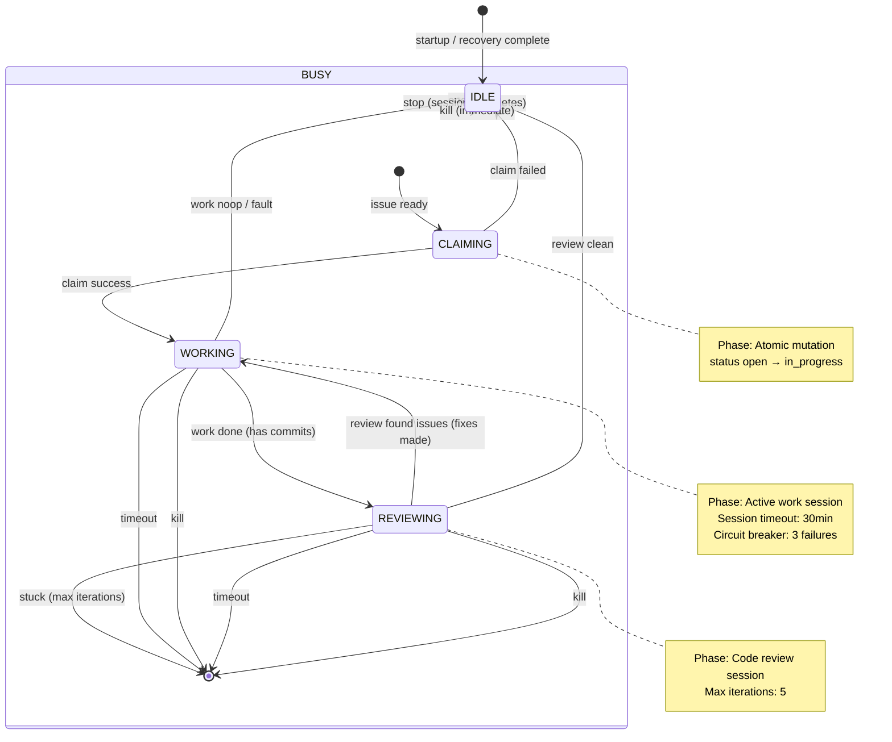

# FLUX Design Document

## Summary

An autonomous agent orchestrator with built-in issue tracking, realtime UI, and its own MCP server.

## Decisions

- **Stack**: React + React Router + Bun native server + Tailwind + DaisyUI
- **Backend**: Convex (realtime persistence, replaces SQLite)
- **Icons**: Font Awesome Pro kit
- **Process**: Single Bun process (MCP + orchestrator). No supervisor/worker, no globalThis/hot-reload patterns. Stable, start-once.
- **Migration**: Fresh start, standalone implementation.
- **Location**: Standalone repo (can be used by any project, not embedded in arcloop)
- **MCP port**: 8042 (configurable via `FLUX_PORT` env var, Post-MVP: auto-increment if port in use)
- **Agent abstraction**: Build interfaces for swappable agent providers. Implement Claude Code only for now; other providers (OpenCode, etc.) will be added later.

## Architecture

```
┌─────────────────────────────────────────────────┐
│            Bun Server (port 8042)               │
│  ┌─────────────────────────────────────────┐    │      ┌──────────────┐
│  │  React Frontend (HTML import)           │────│─────▶│              │
│  │  - useQuery (realtime)                  │◀───│──────│   Convex     │
│  │  - useMutation                          │    │      │              │
│  └─────────────────────────────────────────┘    │      └──────────────┘
│  ┌─────────────────────────────────────────┐    │             ▲
│  │  MCP endpoint (/mcp)                    │    │             │
│  ├─────────────────────────────────────────┤    │─────────────┘
│  │  Orchestrator                           │    │  (ConvexClient + onUpdate)
│  │  ├── Scheduler → subscribe issues.ready │    │
│  │  ├── Executor  → spawn claude CLI       │    │
│  │  ├── Monitor   → stream-json parsing    │    │
│  │  └── Feedback  → retro + review loop    │    │
│  └─────────────────────────────────────────┘    │
└─────────────────────────────────────────────────┘
```

- Single Bun.serve() process hosts everything: React frontend (via HTML import), MCP endpoint, orchestrator
- Both React and server-side code use **realtime Convex subscriptions** (useQuery / onUpdate)
- Scheduler is **subscription-driven**, not poll-driven — reacts instantly when work appears
- No event bus needed — Convex subscriptions replace all pub/sub
- No SQLite — Convex is the only data store
- Bun handles bundling, HMR, and dev server — no separate Vite process

## Convex Schema

### projects
| Field | Type | Notes |
|-------|------|-------|
| slug | string | "arcloop" |
| name | string | "ArcLoop Engine" |
| description | string? | |
| issueCounter | number | Default 0. Incremented on issue create for JIRA-style shortIds. |
| **Indexes** | by_slug | |

### labels
| Field | Type | Notes |
|-------|------|-------|
| projectId | id("projects") | |
| name | string | "bug", "chore", "feature", etc. |
| color | string? | Hex color for UI badge |
| **Indexes** | by_project, by_project_name (unique) | |

### epics
| Field | Type | Notes |
|-------|------|-------|
| projectId | id("projects") | |
| shortId | string | "ARCL-E1" (JIRA-style) |
| title | string | |
| description | string? | |
| status | "open" \| "closed" | |
| labelIds | id("labels")[] | References to labels table |
| closedAt | number? | |
| closeReason | string? | |
| updatedAt | number? | Last modified timestamp. Updated on field changes, child issue changes, comments. |
| **Indexes** | by_project, by_project_status | |

### issues
| Field | Type | Notes |
|-------|------|-------|
| projectId | id("projects") | |
| epicId | id("epics")? | Optional. Belongs to this epic. Standalone issues (quick fixes, retro findings) don't need an epic. |
| sourceIssueId | id("issues")? | If this issue was discovered during work on another issue (retro/review finding). |
| shortId | string | "ARCL-1" (JIRA-style numeric) |
| title | string | |
| description | string? | |
| status | "open" \| "in_progress" \| "closed" \| "deferred" \| "stuck" | See Status Semantics below. |
| priority | "critical" \| "high" \| "medium" \| "low" | Named priorities. Critical = drop everything, Low = when time permits. |
| labelIds | id("labels")[] | References to labels table |
| assignee | string? | |
| failureCount | number | Default 0. Incremented per failed work attempt (fault, malformed response, timeout, orphan). **Reset to 0 only when:** user calls `issues_retry`. **Never reset on success** — history preserved for investigation. Circuit breaker trips at `maxFailures` (default 3). |
| reviewIterations | number | Default 0. Incremented on each review session completion (each pass through the review loop). |
| closeType | "completed" \| "noop" \| "duplicate" \| "wontfix" \| null | How the issue was closed. See Close Types below. |
| closeReason | string? | Free text explanation (especially for noop/duplicate/wontfix). |
| closedAt | number? | |
| deletedAt | number? | Soft delete timestamp. Null = not deleted. All queries filter out deleted issues by default. |
| updatedAt | number? | Last modified timestamp (for "recently updated" sorting/filtering). |
| **Indexes** | by_project_deletedAt_status, by_epic | |
| **Search** | searchIndex: title, description | For `issues_search` full-text search. Uses Convex text search: https://docs.convex.dev/search/text-search |

**Soft Delete**: Issues are soft-deleted by setting `deletedAt`. They remain in the database but are excluded from all queries via `deletedAt: null` filter. Hard delete (permanent removal) can be added as a background cleanup job post-MVP. Only users can delete issues via the UI (with confirmation). Agents cannot delete — they should defer with a note recommending deletion.

**Hard Delete (Post-MVP)**: Background cron job permanently removes soft-deleted issues after N days (configurable retention period, default 30 days). Adds `deletedBy` field for audit trail.

**Query Pattern**: All issue queries should use the `by_project_deletedAt_status` compound index with `.eq("deletedAt", undefined)` to exclude soft-deleted issues at the index level.

**Archiving (Post-MVP)**: Old closed issues could be archived (hidden from default views but not deleted). Could add `archivedAt: number?` field later. For MVP, users can filter by status and sort by closedAt to manage old issues.

### llmCosts
| Field | Type | Notes |
|-------|------|-------|
| model | string | Unique model identifier (e.g., "claude-sonnet-4.5") |
| inputTokenCost | number | Cost per 1M input tokens in USD (e.g., 3.0 for $3.00) |
| outputTokenCost | number | Cost per 1M output tokens in USD (e.g., 15.0 for $15.00) |
| **Indexes** | by_model (unique) | |

**Pre-seeded models** (Claude 4.5):
```typescript
const DEFAULT_LLM_COSTS = [
  { model: "claude-haiku-4.5", inputTokenCost: 1.0, outputTokenCost: 5.0 },    // $1.00/$5.00 per 1M
  { model: "claude-sonnet-4.5", inputTokenCost: 3.0, outputTokenCost: 15.0 },  // $3.00/$15.00 per 1M
  { model: "claude-opus-4.5", inputTokenCost: 5.0, outputTokenCost: 25.0 },   // $5.00/$25.00 per 1M
];
```

Cost calculation in sessions: `(inputTokens * inputCost + outputTokens * outputCost) / 1_000_000`

**updatedAt Semantics**: Updated on every touch to the issue, including:
- Direct field updates (title, description, status, priority, etc.)
- Comment added to the issue
- Session completed for the issue
- Dependency added or removed
This provides "last activity" tracking for sorting and filtering.

### comments
| Field | Type | Notes |
|-------|------|-------|
| projectId | id("projects") | For querying |
| issueId | id("issues") | |
| sessionId | id("sessions")? | If created by agent during a session |
| author | "user" \| "agent" \| "flux" | user=human, agent=AI agent, flux=system |
| content | string | The note text |
| createdAt | number | |
| **Indexes** | by_issue, by_project | |

Comments provide a flexible audit trail for issues. They can be used for:
- Defer/undefer explanations (**required for agents**, optional for users — agents must justify decisions for auditing/trust/debugging)
- Agent observations during work ("considered X approach but rejected because Y")
- User context for agents ("see Slack thread for requirements discussion")
- General notes and discussion

**UI Comment Management**: Users can edit/delete their own comments via the UI. Agents cannot edit/delete comments (immutability for audit trail). MCP does not expose `comments_edit` or `comments_delete` — agents can only add comments.

### dependencies
| Field | Type | Notes |
|-------|------|-------|
| blockerId | id("issues") | The issue that must complete first |
| blockedId | id("issues") | The issue that is blocked |
| **Indexes** | by_blocker_blocked, by_blocked | |

Note: "discovered-from" provenance is now tracked via `sourceIssueId` on the issue itself, not as a dependency.

**Cycle Detection**: The `deps.add` mutation must validate that adding the dependency doesn't create a cycle. Traverse the dependency graph from `blockedId` to ensure `blockerId` is not reachable.

### sessions
| Field | Type | Notes |
|-------|------|-------|
| projectId | id("projects") | |
| issueId | id("issues") | |
| type | "work" \| "review" | Work = main task execution + retro (resumed). Review = code review session. |
| agentSessionId | string | Claude session UUID (used for --resume) |
| agent | string | Agent provider name (e.g., "claude"). Extensible for future providers. |
| status | "running" \| "completed" \| "failed" | |
| disposition | "done" \| "noop" \| "fault" \| null | Parsed from agent's structured response. See Agent Response Schema. |
| note | string? | Agent's explanation (parsed from structured response). |
| startedAt | number | |
| endedAt | number? | |
| lastHeartbeat | number? | Updated every 30 seconds by monitor. Used for orphan detection (stale if > 5 minutes). |
| exitCode | number? | |
| turns | number? | Number of agent turns in session |
| tokens | number? | Total tokens consumed |
| cost | number? | Estimated cost in USD |
| toolCalls | number? | Number of tool calls made |
| startHead | string? | Git HEAD when work began (recorded at session start) |
| endHead | string? | Git HEAD when session ended (updated after each session/review) |
| model | string? | LLM model used (e.g., "claude-sonnet-4.5"). Used with llmCost table for pricing. |
| **Indexes** | by_project_startedAt, by_project_status_startedAt, by_issue | |

**Session Types and Phases:**

- **Work session** (`type: "work"`): Main task execution + retro (two prompts in one session)
  1. Work prompt: Agent implements the issue
  2. Retro prompt: Agent reflects on the work (same session, resumed with retro prompt)
  
- **Review session** (`type: "review"`): Code review, stateless — each review gets full context

Note: Retro is part of the work session (resumed with retro prompt at the end), not a separate session type. Review is a distinct session type.

### sessionEvents
| Field | Type | Notes |
|-------|------|-------|
| sessionId | id("sessions") | |
| sequence | number | Order within session (0, 1, 2, ...) |
| direction | "input" \| "output" | Input = prompt sent to agent. Output = agent response line. |
| content | string | Raw content (prompt text or stream-json line) |
| timestamp | number | When this event occurred |
| **Indexes** | by_session | |

Captures all input/output for a session for debugging and review. Input events are the prompts we send; output events are the raw stream-json lines from the agent.

**Dual Storage Architecture**:

The sessionEvents table is **only** for persistent history and audit. **Convex is NOT streamed to** for realtime display — that would be unnecessary overhead.

```
Agent Output → Monitor
                ├──► Tmp File ──► SSE ──► Browser (realtime display)
                └──► Convex (sessionEvents table) ──► History/Audit/Debugging
```

**Storage Purposes**:
1. **Tmp file (`/tmp/flux-session-{id}.log`)** — Ephemeral, realtime streaming via SSE to browser dashboard. Cleared on session end. Used for:
   - Live activity viewing during active sessions
   - Crash recovery (inspection after unexpected termination)

2. **sessionEvents table** — Persistent, queryable history. Used for:
   - Session detail pages (transcript review)
   - Debugging and audit trails
   - Metrics and analytics

**Why not stream to Convex?** Realtime display requires low-latency streaming. SSE from tmp file provides this without Convex write overhead. Convex subscriptions are used for history display, not live streaming.

**Storage note**: This table can grow large. Post-MVP, add a cleanup job to delete events for old archived sessions.

### orchestratorConfig
| Field | Type | Notes |
|-------|------|-------|
| projectId | id("projects") | One per project |
| enabled | boolean | |
| agent | string | Default "claude". Agent provider to use. |
| focusEpicId | id("epics")? | If set, only work issues from this epic (critical/high standalone still interrupt). |
| sessionTimeoutMs | number | Default 1800000 (30 min). Kill session if exceeded. |
| maxFailures | number | Default 3. Circuit breaker threshold per issue. |
| maxReviewIterations | number | Default 10. Max review passes before closing (trusts last reviewer disposition). |
| **Indexes** | by_project | |

---

## Status Semantics

| Status | Orchestrator picks up? | Blocks dependents? | Meaning |
|--------|------------------------|-------------------|---------|
| `open` | Yes (if ready) | Yes | Work not started |
| `in_progress` | No | Yes | Currently being worked |
| `closed` | No | **No** | Done (see closeType for how) |
| `deferred` | No | Yes | Intentionally postponed (still needed, just not now) |
| `stuck` | No | Yes | Issue exceeded failure/review limits, human intervention required |

**`stuck`** is an **issue status** (not an orchestrator state). Set when:
- Review loop entered with `reviewIterations >= maxReviewIterations` (pre-loop guard)
- `failureCount` exceeded `maxFailures` (default 3) — circuit breaker tripped
- Dependents remain blocked — the work isn't done

Human intervention required: use `issues_retry` to reset to `open`, or close manually. Once retried, `failureCount` and `reviewIterations` reset to 0 for a fresh attempt.

---

## Close Types

When an issue is closed, `closeType` indicates how:

| closeType | Meaning |
|-----------|---------|
| `completed` | Normal completion with work done |
| `noop` | Verified no-op — agent determined no work was needed (already fixed, duplicate effort, etc.) |
| `duplicate` | Duplicate of another issue |
| `wontfix` | Intentionally not fixing |

`closeReason` provides the free-text explanation, especially important for `noop`, `duplicate`, and `wontfix`.

---

## Agent Response Schema

All agent sessions (work, retro, review) must end with a structured JSON response:

```json
{
  "disposition": "done" | "noop" | "fault",
  "note": "string explaining the outcome"
}
```

### Disposition Semantics

| Disposition | Meaning |
|-------------|---------|
| `done` | Task executed successfully. Work was performed. |
| `noop` | Task executed successfully, but no action was needed. Already fixed, duplicate, requirements no longer applicable, etc. |
| `fault` | Task could not execute. Something prevented the work — missing access, unclear requirements, tooling failure, API error, etc. **This is an operational failure, not a judgment on the code quality.** |

### Prompt Instructions for Agents

Include in all agent prompts:

```
End your session with a JSON response block:

{"disposition": "done", "note": "Description of what you accomplished."}
{"disposition": "noop", "note": "Why no work was needed."}
{"disposition": "fault", "note": "What prevented you from completing the task."}

Disposition meanings:
- "done": You completed the task successfully.
- "noop": You determined no work was needed (already fixed, duplicate, etc.).
- "fault": You could NOT complete the task due to an operational problem
  (missing access, unclear requirements, tooling error, API failure).
  This does NOT mean the code is bad — it means the task itself couldn't run.
```

For **review sessions**, add clarity:

```
For reviews specifically:
- "done": You completed the review. Findings were either fixed inline or captured as follow-up issues.
- "noop": You completed the review and found no issues — the code is clean.
- "fault": You could NOT complete the review due to an operational problem.
  This does NOT mean the code failed review — it means the review itself couldn't run.
```

---

## Orchestrator Flow

### Work Session Flow

```
1. Claim issue (atomic mutation: set status="in_progress" only if status="open")
2. Record startHead (current git HEAD)
3. Spawn agent with issue prompt
4. Monitor output, update lastHeartbeat periodically
5. Parse structured response for disposition + note
6. Record endHead, session metrics

If disposition == "fault" OR no valid response:
  → failureCount++, status="open" (will retry or hit circuit breaker)

If disposition == "noop":
  → status="closed", closeType="noop", closeReason=note
  → Skip review (nothing to review)

If disposition == "done":
  If startHead == HEAD (no commits):
    → Treat as noop: status="closed", closeType="noop", closeReason=note
    → Skip review
  Else:
    → Proceed to review loop
```

### Review Loop Flow

Review sessions are stateless — each review gets full context and doesn't know if it's a follow-up.

```
1. Start review session (type="review")
2. Provide full context:
   - Diff: startHead..HEAD (commits since work began, determined by `git log startHead..HEAD`)
   - List of issues where sourceIssueId = this issue (from retro + previous reviews)
3. Agent reviews, may fix inline or create follow-up issues
4. Parse structured response for disposition + note
5. Update endHead to current HEAD
6. Increment reviewIterations (every completed review, regardless of commits)

If disposition == "fault":
  → failureCount++, review failed

If disposition == "done" or "noop":
  Check for new commits: git log startHead..HEAD (before step 5 update)
  
  If new commits exist (review fixed something inline):
    If reviewIterations >= maxReviewIterations:
      → Trust reviewer disposition and close as completed (inline fixes unverified)
    Else:
      → Start another review (loop back to step 1)
  Else (no new commits - all findings captured as issues):
    → Review passed clean
    → status="closed", closeType="completed"
```

**Clarification on Review Outcomes**:
- Review can result in **both** new commits (inline fixes) AND follow-up issues
- If any commits were made → loop continues (the fix needs review)
- If no commits made → passes (even if follow-up issues were created, those are separate work items)
- `reviewIterations` increments unconditionally on every completed review (done/noop), regardless of commits

**Example Flow**:
```
Review 1: disposition=done, commits=3 issues=2 → iteration=1, loop continues
Review 2: disposition=done, commits=0 issues=1 → iteration=2, passes (follow-ups created)
```

### Inference Table: Worker Sessions

| Disposition | Commits? | Result |
|-------------|----------|--------|
| `done` | Yes | Proceed to review loop |
| `done` | No | Close as noop (agent said done, nothing changed — trust it) |
| `noop` | — | Close as noop |
| `fault` | — | `failureCount++`, status stays `open` |
| (malformed) | — | `failureCount++`, status stays `open` |

### Inference Table: Review Sessions

| Disposition | Commits? | Result |
|-------------|----------|--------|
| `done` | Yes | `reviewIterations++`, re-review needed (fixes were made) |
| `done` | No | Pass (findings became issues, not inline fixes) |
| `noop` | — | Pass (nothing found) |
| `fault` | — | `failureCount++`, review failed |
| (malformed) | — | `failureCount++`, review failed |

**Note**: `reviewIterations` increments on **every completed review session** (disposition `done` or `noop`), regardless of whether commits were made. This counts review passes, not just fixes.

---

## Issue Claiming

To prevent race conditions (multiple schedulers, rapid subscription updates), issue claiming uses an atomic mutation:

```typescript
// Convex mutation: claimIssue (convex/issues.ts)
// Returns { success: true, issue } or { success: false, reason }
export async function claimIssue(ctx, { issueId, assignee }) {
  const issue = await ctx.db.get(issueId);
  if (issue.status !== "open") {
    return { success: false, reason: "not_open" };
  }
  await ctx.db.patch(issueId, {
    status: "in_progress",
    assignee,
    updatedAt: Date.now()
  });
  return { success: true, issue };
}
```

The scheduler must check the return value — if claim fails, skip and try the next ready issue.

---

## MCP Server

Flux exposes multiple MCP tools, each with a clear purpose. Standard MCP pattern — no sub-action routing needed.

**Pagination**: All list operations support `limit` (default 50, max 200) and `cursor` for pagination. Response includes `nextCursor` if more results exist.

### Issues Tools
| Tool | Description |
|------|-------------|
| `issues_list` | List with filters (status, priority, labels, epic). Excludes soft-deleted (deletedAt: null). Paginated. |
| `issues_create` | Create issue (optionally assign to epic) |
| `issues_show` | Detail with deps and comments |
| `issues_update` | Update fields/status |
| `issues_close` | Close with closeType and optional reason |
| `issues_ready` | Unblocked open issues (excludes failureCount >= maxFailures). Paginated. |
| `issues_defer` | Defer an issue (requires note — creates comment automatically) |
| `issues_undefer` | Undefer an issue (requires note — creates comment automatically) |
| `issues_retry` | Reset stuck/failed issue to open, clearing failureCount for a fresh attempt |
| `issues_search` | Full-text search across titles and descriptions using Convex searchIndex |

Note: `issues_delete` is intentionally not exposed to agents. Agents should defer with a note like "recommend deletion" and let humans decide. Soft delete is handled via UI only.

### Comments Tools
| Tool | Description |
|------|-------------|
| `comments_list` | List comments for an issue. Paginated. |
| `comments_create` | Add a comment to an issue |

### Epics Tools
| Tool | Description |
|------|-------------|
| `epics_list` | List epics with filters. Paginated. |
| `epics_create` | Create epic |
| `epics_show` | Detail with child issues |
| `epics_update` | Update fields/status |
| `epics_close` | Close epic (no validation — can close with open issues; UI shows open issue count in epic list) |

**Note**: `epics_delete` is UI-only. Agents cannot delete epics.

### Labels Tools
| Tool | Description |
|------|-------------|
| `labels_list` | List labels for project |
| `labels_create` | Create label |
| `labels_update` | Update label |
| `labels_delete` | Delete label |

### Dependencies Tools
| Tool | Description |
|------|-------------|
| `deps_add` | Add dependency (validates no cycle) |
| `deps_remove` | Remove dependency |
| `deps_listForIssue` | List all dependencies for an issue (both blockers and blocked-by) |

### Batch Operations Tools
| Tool | Description |
|------|-------------|
| `issues_bulk_create` | Create multiple issues in one call (useful for retro findings) |
| `issues_bulk_update` | Update multiple issues (e.g., batch defer/undefer, priority changes) |

### Sessions Tools
| Tool | Description |
|------|-------------|
| `sessions_list` | List/filter sessions. Paginated. |
| `sessions_show` | Session detail with metrics |

Note: Session lifecycle (start/stop) is internal to the orchestrator, not exposed via MCP. Agents should not be able to stop their own sessions.

### Orchestrator Tools
| Tool | Description |
|------|-------------|
| `orchestrator_status` | Current orchestrator state |
| `orchestrator_enable` | Start the scheduler — begins picking up ready issues |
| `orchestrator_stop` | Stop queuing new work, let current session finish gracefully |
| `orchestrator_kill` | Kill the running agent immediately, leave uncommitted work for human to handle |

### Response Metadata

Every tool response includes `_meta`:
```json
{
  "project": "arcloop",
  "timestamp": 1234567890
}
```

**TODO (FLUX-245)**: Add orchestrator status context:
```json
{
  "project": "arcloop",
  "timestamp": 1234567890,
  "orchestrator_status": "running",
  "active_session": "session-id-or-null",
  "scheduler_enabled": true
}
```

This gives agents context about the current project and system state with every call.

## Defer/Undefer Workflow

Issues that need human review before work begins should be created with `status=deferred`. This keeps them out of the orchestrator's ready queue until a human (or agent with good reason) explicitly undefers them.

**When to defer** (agents should use sparingly):
- Breaking API/ABI changes that affect consumers
- Architectural decisions with significant trade-offs
- Ambiguous requirements that could go multiple valid directions
- Changes that might conflict with in-flight human work
- Security-sensitive changes requiring human sign-off

**When NOT to defer** (agents should make the call):
- Implementation details within established patterns
- Bug fixes with clear solutions
- Refactoring that follows existing conventions
- Documentation updates
- Test additions

**MCP Tool Behavior**:
- `issues.defer` **requires a note** — creates a comment explaining why
- `issues.undefer` **requires a note** — creates a comment explaining the decision
- **Rationale**: Agents must justify their decisions for auditing/trust/debugging. The requirement ensures accountability.

**UI Behavior**:
- Defer button opens modal prompting for a note (**optional for users**)
- Undefer button opens modal prompting for a note (**optional for users**)
- If user provides a note, a comment is created; if blank, no comment
- **Distinction**: Users have discretion — they own the decision. Agents must document rationale.
- Deferred issues should have distinct visual treatment (badge, color)
- Dashboard can show "Deferred" count, optionally filtered by label (e.g., `pending-review`)

**Orchestrator Behavior**:
- `issues.ready` query excludes `status=deferred` issues
- Scheduler never picks up deferred issues
- Once undeferred (status changed to `open`), issue enters the ready queue

## Keyboard Shortcuts (MVP) — TODO FLUX-246

Essential keyboard shortcuts for power users. Establishes the pattern; more shortcuts will be added Post-MVP.

**Status**: Not yet implemented

| Shortcut | Action | Context | Status |
|----------|--------|---------|--------|
| `Cmd/Ctrl + K` | **Global Search** | Opens quick search across all issues | 🔲 TODO |
| `Cmd/Ctrl + Shift + N` | **Quick Create** | Opens create issue modal with title focused | 🔲 TODO |

**Search Modal (`Cmd+K`)**:
- Type to search across issue titles and descriptions
- Arrow keys navigate results
- Enter opens selected issue
- Escape closes modal

**Quick Create (`Cmd+Shift+N`)**:
- Pre-fills current epic if on epic detail page
- Title field focused, ready for immediate input
- Tab navigates to description → priority → create button

---

## Orchestrator Control

Three control actions manage the scheduler lifecycle:

| Action | Effect |
|--------|--------|
| `enable` | Start the scheduler. Subscribes to `issues.ready`, picks up work when available. |
| `stop` | Stop picking up new work. Current session (if any) continues to completion. Scheduler goes idle after. |
| `kill` | Immediately kill the running agent process. Issue stays `in_progress`. Uncommitted work left in working tree for human to handle. |

**State Machine Diagram:**



**Note on Diagram**: The diagram above shows **internal phases** within the `BUSY` state (claiming, working, reviewing), not separate orchestrator states. These phases are derived from reactive queries (session type, status, endHead presence), not stored state. The orchestrator itself only tracks the four states below.

**Orchestrator States** (runtime state of the Flux daemon):

| State | Description | Transitions |
|-------|-------------|-------------|
| `IDLE` | Not processing work. Either no ready issues exist, scheduler explicitly stopped, or waiting between issues. | `enable` → BUSY |
| `BUSY` | Active session in progress (claiming, working, reviewing). | `stop` → IDLE (after session completes), `kill` → IDLE (immediate) |
| `STOPPED` | Scheduler disabled via `orchestrator_stop`. Current session (if any) continues, then goes IDLE. | `enable` → BUSY |
| `FAULT` | Fatal error in orchestrator (e.g., Convex connection lost). Requires restart. | Manual restart → IDLE |

**Important distinction**: These are orchestrator states. Issue statuses (`open`, `in_progress`, `closed`, `deferred`, `stuck`) are separate. An orchestrator in `BUSY` state works on an issue with `in_progress` status.

**UI Display**: The UI derives substates (claiming, working, reviewing) from reactive Convex queries using session and issue fields:
- `BUSY [claiming] ARCL-123` — No session record yet, attempting atomic claim
- `BUSY [working] ARCL-123` — Session exists, `type: "work"`, `status: "running"`, no `endHead`
- `BUSY [reviewing] ARCL-123` — Session exists, `type: "review"`, `status: "running"`

Use `ts-pattern` for clean conditional matching throughout:
```typescript
match({ orchestratorState, session, issue })
  .with({ orchestratorState: 'BUSY', session: null }, () => 'claiming')
  .with({ orchestratorState: 'BUSY', session: { type: 'work' } }, () => 'working')
  .with({ orchestratorState: 'BUSY', session: { type: 'review' } }, () => 'reviewing')
  .otherwise(() => orchestratorState);
```

Apply `ts-pattern` to:
- State machine transitions (orchestrator)
- Disposition parsing and routing
- Status change validation
- UI phase derivation

**After `kill`:**
- Issue remains `in_progress` (not reset to `open`)
- Assignee remains unchanged (for context/history)
- Orchestrator transitions to `IDLE` state ("hand-off" mode)
- Human reviews uncommitted changes in working tree
- Human can: commit + close, discard + reopen, or resume manually
- Scheduler (in `IDLE` state) won't pick up `in_progress` issues — human must resolve
- **Hand-off semantics**: System stops and relinquishes control to human. No automatic cleanup, no state changes — everything preserved exactly as-is for inspection and debugging.

## Work Selection Algorithm

How does the scheduler pick the next issue?

### Epics Are Optional
- Epics group related work (milestones, features, refactors)
- Standalone issues don't need an epic — quick fixes, retro findings, friction fixes exist at project level
- Epic membership is for organization, not gating
- Epics can be closed with open issues — it's the user's call

### Priority Is Global
- A critical issue is critical, regardless of epic membership
- High-priority standalone issues don't wait for epic work
- This prevents low-priority epic tasks from blocking critical fixes

### Selection Order
The `issues.ready` query returns issues sorted by:
1. **Priority** (critical → high → medium → low)
2. **Creation time** (older issues first, FIFO within same priority)

```
critical standalone fix    ← worked first
critical issue in Epic A   ← next
high issue in Epic A
high standalone fix
medium issue in Epic B
medium issue in Epic A
low standalone cleanup
```

Epic membership doesn't affect selection order. If Epic B work depends on Epic A completing, use explicit blockers on the issues.

### Epic Focus Mode (Optional)
For concentrated milestone work, the orchestrator config can set `focusEpicId`:
- When set, scheduler **only** picks issues from that epic
- critical/high standalone issues still interrupt (safety valve)
- Useful for "finish this milestone" pushes

### Standalone Issue Sources
Issues without epics typically come from:
- Retro findings (friction, tooling gaps)
- Review findings (code quality issues)
- Quick fixes discovered during other work
- Ad-hoc requests

These shouldn't require epic assignment — that's ceremony for no benefit.

## Agent Tenets

These principles guide all Flux agents. Split into **Core** (always included) and **Extended** (task-type specific) to avoid overwhelming prompts.

### Core Tenets (All Prompts)

**Bold & Deliberate**
- Every action has a clear, specific purpose
- No "hoping it works" — **know** what each line does
- Do not write code you do not understand

**No Silent Fallbacks**
- **Fail fast.** If something fails, we want to know immediately and why
- Fallbacks must be explicit, documented decisions — never implicit
- **No logging-only errors.** Catching an error and only logging it means the program continues in a broken state. Propagate, crash the subsystem, or set a flag the caller must check
- **No legacy safety nets.** Never leave "backwards compatibility" fallback code. It masks bugs. Delete the old path entirely

**The Prime Directive: Validate**
- **You are blind.** The tools are your cane
- Never declare a task done until you have **programmatically verified** it
- :x: "I updated the code. Run it to see."
- :white_check_mark: "I updated the code. I ran the test and confirmed the behavior changed."

### Extended Tenets (Task-Specific)

**Code Stewardship** (Task Execution + Retro)
- Every file you touch should be slightly better than when you found it
- Refactor proactively — don't leave broken windows
- Use modern APIs — don't cling to deprecated patterns
- No lazy TODOs — explain _why_ and _what_ is missing

**Tool Ownership** (Task Execution + Retro)
- You own the tools. Build them, improve them, extend them
- Don't work around a bad tool — make the tool better
- **Fix friction immediately** if it's <100 lines. Do not document and move on
- **If the same friction surfaces twice, stop.** Fix it before continuing

**Agency Over Deference** (Task Execution)
- Strong preference: **make the call yourself**
- Only flag `needsHumanApproval` for genuine design decisions, breaking changes, or ambiguous requirements
- Implementation details within established patterns? Make the call
- Bug fixes with clear solutions? Make the call
- Refactoring that follows conventions? Make the call

**Acting on Feedback** (Task Execution + Review)
- The cycle is: Review → Fix → Review → Fix ... until clean
- There is no "future work" for things you just wrote
- For each finding: **fix it now** OR **document why you can't** with a `// TODO:` comment
- Strong preference: just fix it

**Process Adaptation** (Retro only)
- Rigid protocol adherence in the face of obvious waste is a bug
- Skip redundant exploration — check git log first
- Batch related commits into logical units
- Escalate repeated friction — treat fixing it as higher priority than the current task

**Peripheral Vision** (Task Execution)
- Every Flux response includes `_meta` with system state
- Check health before assuming tools work
- A broken pipeline is higher priority than whatever task you were working on

---

## Tenet Integration by Prompt Type

### Task Execution Prompt
Include Core + Extended:
- Bold & Deliberate, No Silent Fallbacks, Prime Directive (core)
- Code Stewardship, Tool Ownership, Agency Over Deference, Acting on Feedback, Peripheral Vision (extended)

### Retro Prompt
Post-session retrospective focuses on:
- Tool Ownership (what friction did you hit? can you fix it now?)
- Process Adaptation (what was wasteful? what should change?)
- Code Stewardship (what code did you *see* that could be improved?)
- The "same friction twice" rule (if you've seen this before, fix it NOW)

### Review Prompt
Code review focuses on:
- No Silent Fallbacks (are errors handled or swallowed?)
- Bold & Deliberate (is every line intentional?)
- Acting on Feedback (fix it or document why you can't)
- Agency Over Deference (make the call on suggestions unless truly ambiguous)

### Priority for Follow-up Issues
When retro/review create issues:
- `critical`: Safety/correctness issues, immediate fixes
- `high`: Warnings, clear fixes needed
- `medium`: Suggestions, improvements
- `low`: Low-priority cleanup
- `needsHumanApproval=true`: Only for genuine ambiguity — architectural decisions, breaking changes, conflicting requirements

## Agent Provider Interface

Flux is designed to support multiple agent providers. For now, only Claude Code is implemented.

```typescript
interface AgentProvider {
  /** Provider identifier (e.g., "claude", "opencode") */
  name: string;

  /** Spawn an agent process */
  spawn(opts: SpawnOptions): AgentProcess;

  /** Resume an existing session with a new prompt (e.g., for retro after work completes) */
  resume(opts: ResumeOptions): AgentProcess;

  /** Parse a line of stdout into a structured event (or null if not parseable) */
  parseOutput(line: string): ParsedEvent | null;

  /** Build the initial prompt for a work session */
  buildWorkPrompt(issue: Issue, context: WorkContext): string;

  /** Build the prompt for a review session */
  buildReviewPrompt(issue: Issue, context: ReviewContext): string;

  /** Build the retro prompt (used when resuming a work session) */
  buildRetroPrompt(issue: Issue, context: RetroContext): string;
}

interface SpawnOptions {
  cwd: string;
  prompt: string;
  outputFormat: "stream-json" | "text";
}

interface ResumeOptions {
  cwd: string;
  prompt: string;
  sessionId: string;  // Provider-specific session ID to resume
  outputFormat: "stream-json" | "text";
}

interface AgentProcess {
  pid: number;
  stdout: ReadableStream;
  stderr: ReadableStream;
  kill(): void;
  wait(): Promise<{ exitCode: number }>;
}
```

**Resume Semantics**:
- Each provider implements `resume()` according to its own session management model
- Claude Code: uses `--resume {sessionId}` CLI flag
- OpenCode (future): might use REST API call to `opencode serve` headless agent
- The orchestrator calls `resume()` for the retro phase after work completes, using the same `agentSessionId` stored in the session record

**Current implementation**: `ClaudeCodeProvider` in `src/server/orchestrator/agents/claude.ts`

**Future providers**: OpenCode, Aider, custom agents. Each implements the interface and handles its own CLI invocation and output parsing.

## Review Architecture

- **Prompt-driven**: The review prompt instructs the agent to "perform a code review, using subagents where appropriate"
- **Agent discovers SMEs**: If the project has review subagents defined (skills, agent definitions), the agent will use them automatically — same as if a human asked for review
- **No Flux-side detection**: Flux doesn't need to know what review agents exist. It just prompts for review and lets the agent figure out what's available
- **General fallback**: The review prompt includes universal concerns (safety, correctness, performance, style) — comprehensive enough when no specialists exist
- **Output**: Agent returns structured JSON response (disposition + note)

---

## Post-MVP Enhancements

Features deferred until core system is validated:

- **Kanban board**: Drag-drop status changes
- **Epics management**: Epic list view, drill-down to child issues
- **Keyboard shortcuts**: j/k navigation, quick create (Cmd+Shift+N)
- **Mobile responsive**: Layout adjustments for small screens
- **Rich activity rendering**: Parse stream-json for tool call visualization
- **Search**: Full-text search across issues (Cmd+K)
- **Analytics**: Cost tracking dashboards, failure rate metrics
- **Hard delete**: Background cleanup of soft-deleted issues
- **Session archiving**: Auto-archive old session events

---

## MCP Transport

Flux uses a **stdio MCP transport** that proxies tool calls to the Bun server via REST:

```
Claude Code → stdio → bin/flux-mcp-stdio.ts → POST /api/tools → Bun Server → handlers
```

**Why stdio over HTTP?** The HTTP MCP transport loses sessions on Bun hot-reload, requiring constant `/mcp` reconnects. With stdio, the MCP process is stable while the Bun server hot-reloads behind it — handler changes take effect immediately with zero reconnection.

All tool schemas are registered upfront in `src/server/tools/schema.ts`. Unimplemented tools return "Not implemented" errors. As handlers land, agents see them immediately.

### .mcp.json

```json
{
  "mcpServers": {
    "flux": {
      "type": "stdio",
      "command": "bun",
      "args": ["run", "/Users/jason/Projects/flux/src/server/index.ts"]
    }
  }
}
```

### REST Tool Endpoint

`POST /api/tools` accepts `{ "tool": "<name>", "args": {...} }` and dispatches to the handler. This is the bridge between the stdio MCP process and the hot-reloading Bun server.

## Testing Strategy

### MVP Phase: Manual Testing Only

**No automated tests until post-MVP.** During initial development:

- APIs are fluid and will change frequently
- Manual testing via `bunx convex run` is sufficient
- Integration via CLI validates end-to-end behavior
- Big refactors expected - tests would create drag

**Manual testing workflow:**
```bash
# Test Convex functions
bunx convex run projects:create '{"slug":"test","name":"Test"...}'
bunx convex run issues:claim '{"issueId":"...","assignee":"agent-1"}'
bunx convex run issues:list '{"projectId":"..."}'

# Test MCP tools (once F2 is built)
curl -X POST http://localhost:8042/mcp -d '{"tool":"issues_list"...}'
```

### Post-MVP: Automated Testing

**When to add tests:**
- After F5 (React Frontend) is stable
- When orchestrator logic becomes complex
- When we need regression protection for critical paths

**Recommended approach:**
Use `convex-test` library with Vitest for proper Convex mocking:
```typescript
import { convexTest } from "convex-test";
const t = convexTest(schema);
await t.mutation(api.issues.claim, { issueId, assignee: "agent-1" });
```

**Never write:** Hand-rolled mock contexts that don't match Convex semantics.

### E2E Testing

**Manual validation checklist** (Post-MVP):
1. Create issue via UI
2. Enable orchestrator
3. Verify session appears in Convex
4. Watch live activity stream
5. Verify retro runs after work
6. Verify review loop completes
7. Check follow-up issues created
8. Verify all data in UI

**Automated E2E** (Post-MVP):
- Consider Playwright for UI testing
- Mock agent responses to avoid needing real API keys
- Run in CI against staging Convex deployment

### Testing Philosophy

- **Test behavior, not implementation**: Verify outcomes, not internal state
- **No tests during API churn**: Wait for interfaces to stabilize
- **Fast feedback**: Unit tests should run in <5 seconds
- **Integration for confidence**: E2E validates the whole system works

## Design Details

### Timestamps
- **Creation time**: Use Convex's automatic `_creationTime` field (available on all documents)
- **Updated time**: Add `updatedAt: number?` to tables where "last modified" is useful for business logic (e.g., issues)
- Don't over-engineer — add fields as needed during implementation

### Markdown Support
- Issue and epic descriptions support markdown
- Use Bun's built-in markdown renderer: `Bun.markdown.html(content)`
- Render in UI with appropriate sanitization

### Indexes
- Don't over-prescribe indexes upfront
- Add indexes as we write queries that need them
- Convex will warn about missing indexes in development

### shortId Generation
- Format: `{PROJECT}-{n}` for issues (e.g., `ARCLOOP-1`, `ARCLOOP-2`), `{PROJECT}-E{n}` for epics (e.g., `ARCLOOP-E1`)
- Project prefix: full project slug in uppercase (no truncation for MVP)
- Numeric suffix: auto-incrementing per project via `issueCounter` / `epicCounter` fields
- Atomic increment in Convex mutation on create
- JIRA-style for familiarity and no collision risk
- **Note**: Full slug prevents collisions (e.g., "arcl" vs "arc-loop" both become distinct prefixes)

### Project Selection
How Flux knows which project to use:

1. **Explicit**: `FLUX_PROJECT=arcl` environment variable (project slug) — **takes priority**
2. **Inferred**: Derive from git remote at CLI level
   - On startup, Flux resolves cwd to repo root (finds `.git`)
   - Parses git remote URL to extract project name (e.g., `github.com/user/flux` → `flux`)
   - Uses that as the project slug
   - If no `.git` found, errors immediately: "Error: Not in a git repository"

**Git Required**: Flux requires a git repository. On startup, if `.git` cannot be found, Flux exits immediately with an error: "Error: Not in a git repository. Flux requires git for project resolution and change tracking."

The MCP server and orchestrator both use this resolution. All actions operate on the resolved project.

**Configuration**:
- `FLUX_PORT` — Override default MCP port (default: 8042)

### Launch Mechanism

**Recommended approach for MVP** (private tool usage):

Add a shell alias/function to your `.zshrc`:

```bash
# Launch Flux from any project directory
flux() {
  local flux_path="/path/to/flux/src/server/index.ts"
  
  # Resolve to repo root
  local repo_root=$(git rev-parse --show-toplevel 2>/dev/null)
  if [ -z "$repo_root" ]; then
    echo "Error: Not in a git repository"
    return 1
  fi
  
  # Change to repo root and run Flux
  cd "$repo_root" && bun run "$flux_path"
}
```

**Usage**:
```bash
# From anywhere in your project
cd ~/Projects/arcl/src/components
flux

# Flux will:
# 1. Resolve to repo root (/Users/jason/Projects/arcl)
# 2. Resolve to repo root and derive project slug from git remote
# 3. Start server for the "arcl" project
```

**Why this approach**:
- Natural workflow: run `flux` from wherever you're working
- No need to remember project slugs or paths
- Multiple repos can share one Convex deployment (each has own project record)
- Simple and direct for a private tool

**Future enhancements** (Post-MVP):
- Global installation: `bun install -g flux` then just `flux` anywhere
- Project creation wizard: `flux init` creates project record in Convex
- Multi-project selector: TUI to pick project when multiple match
- macOS app wrapper: Menu bar app with project selector

**Development workflow**:
```bash
# Terminal 1: Run Flux
cd ~/Projects/arcl && flux

# Terminal 2: Access UI
open http://localhost:8042

# Terminal 3: Use MCP tools (Claude Code, etc.)
claude  # MCP automatically connects to flux server
```

### Agent Context Injection
When spawning an agent, the orchestrator:
1. Resolves repo root from `git rev-parse --show-toplevel` — this is the agent's cwd
2. The project's CLAUDE.md contains tenets, conventions, and context
3. Flux passes the issue details (title, description, shortId) as the initial prompt
4. Flux does NOT inject a system prompt — the project's own config handles that
5. The agent works in the repo naturally, same as a human-started session

### Git State
- Orchestrator checks for clean working tree before starting a session (pre-session auto-commit)
- **Between phases**: auto-commit runs after work→retro, retro→review, and review→next iteration
- Each session records `startHead` (commit SHA at start)
- `endHead` updated after each session/review completes (for posterity, diffing, metrics)
- Commits made during session are tracked via `git log {startHead}..HEAD`
- No branch management by Flux — agent works on whatever branch is checked out
- After `kill`: uncommitted changes stay in working tree for human review
- PID guard prevents race conditions with agent child processes during auto-commit

**Auto-commit Failure Handling:**

When auto-commit fails (no git config, merge conflicts, permission issues):
1. **Log a warning** with full details to console
2. **Continue anyway** — don't block work because of auto-commit failure
3. **Human resolves later** — can commit manually or discard changes

This approach prioritizes progress over tidiness. The orchestrator proceeds to the next phase even if auto-commit fails. The agent is responsible for committing their own work; auto-commit is a safety net only.

**Common auto-commit failures:**
- No git user.name/user.email configured
- Pre-commit hooks failing (linting, tests)
- File permission issues
- Disk space issues
- Agent PID still alive (race condition guard — will retry next phase)

**Recovery:**
```bash
# Human sees uncommitted changes, checks git status
git status
git add .
git commit -m "manual commit after flux auto-commit"
# Or discard changes if they were experimental
git reset --hard HEAD
```

**Auto-commit message format** (when Flux commits on behalf of agent):
```
[{shortId}] chore(flux): auto-commit uncommitted agent changes ({phase})

Session: {sessionId}
```

Where `{phase}` is one of: `work`, `retro`, `review`, or `pre-session`.

**Agent prompt instructions**: Include explicit commit guidance in work prompts:
```
Commit your changes before ending the session. Use clear, descriptive commit
messages. If you cannot complete the task, commit any partial progress with
a WIP prefix so work is not lost.

Important: The Flux orchestrator auto-commits any dirty working tree after your 
session ends with a generic message. To ensure your commits have proper messages, 
always use a single atomic command:

git add <files> && git commit -m "descriptive message"

Never separate `git add` and `git commit` into two tool calls — the orchestrator 
may auto-commit between them, stealing your staged changes.
```

**Agent prompt instructions**: Include explicit commit guidance in work prompts:
```
Commit your changes before ending the session. Use clear, descriptive commit
messages. If you cannot complete the task, commit any partial progress with
a WIP prefix so work is not lost.
```

### Activity Streaming

Realtime view of agent output in the dashboard. Dual storage for reliability:

**Architecture:**
```
┌─────────────┐     stdout      ┌─────────────┐       SSE        ┌─────────────┐
│ Agent (CLI) │ ───────────────▶│ monitor.ts  │ ────────────────▶│   Browser   │
└─────────────┘                 │ (buffer +   │  /sse/activity   └─────────────┘
                                │  tmp file)  │
                                └─────────────┘
```

**Flow:**
1. Monitor parses agent stdout, maintains rolling buffer in memory (last 500 lines)
2. Simultaneously writes to tmp file (`/tmp/flux-session-{id}.log`) for crash recovery
3. Browser connects to `/sse/activity` endpoint (Server-Sent Events)
4. SSE pushes new lines as they arrive
5. On connect, sends current buffer for history, then streams live
6. When session ends, tmp file can be archived or deleted (metrics already in Convex)
7. On crash recovery, tmp file provides last known state for debugging

**Why SSE over WebSocket:**
- Simpler (HTTP, no upgrade handshake)
- One-way is all we need (server → browser)
- Auto-reconnect built into EventSource API

**Claude Code output:**
- `--output-format stream-json` gives structured events
- Parse for tool calls, results, assistant messages
- Render rich UI (tool names, file paths, status indicators)

**Other agents:**
- Each `AgentProvider` implements `parseOutput()` for its format
- Fallback: render as raw terminal output

**ANSI → React:**
- Use `ansi-to-react` (nteract) — outputs React components with class names
- Define ANSI classes in CSS using `@apply` for Tailwind colors:
  ```css
  .ansi-red-fg { @apply text-red-400; }
  .ansi-green-fg { @apply text-green-400; }
  .ansi-yellow-fg { @apply text-yellow-400; }
  /* etc — tune colors to match theme */
  ```
- Render in a `<pre>` with monospace font for terminal feel

### Concurrency
- Single session at a time per project (for now)
- `maxConcurrentSessions` could be added to orchestratorConfig later
- Critical arriving during medium work: queued, picked up after current session completes
- No preemption — finish current work before starting new work

### Timeouts + Failure
- Session timeout: configurable per project (default: 30 minutes)
- If agent exceeds timeout: treated as `kill` — process terminated, issue stays `in_progress`
- Repeated failures on same issue: circuit breaker after N failures (default: 3)
  - Issue marked with `failureCount`, skipped by scheduler until human reviews
  - Prevents infinite retry loops
- Review loop exhaustion: after maxReviewIterations (default: 10), issue closed trusting last reviewer disposition

**Timeout Behavior:**
When a session exceeds `sessionTimeoutMs`, the orchestrator:
1. Sends SIGTERM to the agent process (graceful shutdown attempt)
2. Waits 10 seconds for clean exit
3. Sends SIGKILL if still running
4. Marks session as `failed` with `exitCode: null` and `disposition: "fault"`
5. Issue remains `in_progress` — human must review and decide

**Per-Phase Timeout:**
The `sessionTimeoutMs` timer restarts independently for each phase transition within an issue lifecycle (work → retro → review). Each phase is a separate agent invocation — either a new process (review) or a resumed session with a new prompt (retro) — so each deserves its own full timeout window. This means a single issue could run for up to ~3× the configured timeout in the worst case (e.g., 30min work + 30min retro + 30min review = 90min). This is intentional: capping total wall-clock time per issue would penalize complex work that legitimately needs time in each phase.

### Retry / Backoff Strategy

The scheduler implements intelligent retry with failure tracking:

**Failure Counting:**
- `failureCount` increments on: `fault` disposition, malformed response, timeout, orphaned session
- **Reset conditions** (all reset to 0):
  - User calls `issues_retry`
  - **Never reset on success** — failure history is preserved for investigation even after successful completion
  - Note: Review session failures don't increment failureCount (separate concern)

**Circuit Breaker:**
```typescript
// Ready query filters out issues that have exceeded maxFailures
const candidates = openIssues.filter((i) => i.failureCount < maxFailures);
```

**Scheduler Behavior:**
- First failure: retry on next scheduling cycle (immediate)
- After `maxFailures` (default 3): circuit breaker trips, issue excluded from `issues.ready`
- Human must use `issues_retry` to reset and re-queue

**Review Iteration Behavior:**
- No delay within review loop — iterations happen immediately
- If review fixes were made, next review starts right away
- This ensures rapid iteration on code quality
- Only `maxReviewIterations` limits the loop

### Orphan Detection
On startup, `recovery.ts`:
1. Query sessions where `status = "running"`
2. Check `lastHeartbeat` — if stale (e.g., > 5 minutes old), session is orphaned
3. Check PID lock files — if process not running, confirm orphaned
4. Mark orphaned sessions as `failed`
5. Leave associated issues as `in_progress` for human review

**MVP approach**: Conservative recovery — mark session failed, leave issue for human. Human can:
- Review git state and uncommitted changes
- Use `issues_retry` to reset and re-queue
- Manually close if work was actually complete

**Post-MVP**: Could add smart recovery that checks git state:
- If clean with commits since `startHead` → proceed to review automatically
- If dirty → auto-commit, then proceed
- If no progress → reset issue to `open` for retry

---

## Post-MVP Deferred Items

Features and improvements intentionally deferred to after MVP:

### Data Management
- **sessionEvents archival**: Cleanup job for old session events (currently noted in schema but not implemented)
- **Hard delete**: Permanent removal of soft-deleted issues (background cleanup job after N-day retention, default 30 days)
- **Issue archival**: `archivedAt` field to hide old closed issues from default views without deleting them
- **Metrics aggregation**: Total cost per project, average session duration, failure rate dashboards
- **Data retention policies**: Configurable per-project retention for sessions, events, and deleted issues

### Enhanced Recovery
- **Smart orphan recovery**: Auto-detect if orphaned session made progress, auto-commit, and proceed to review
- **Git state-aware recovery**: Check commits since `startHead` to determine if work was actually completed

### UI/UX Enhancements
- **Kanban board**: Drag-drop issue status management (stretch goal from F5c)
- **Epics drill-down**: Visual epic management with child issue tree
- **Keyboard shortcuts**: j/k navigation, quick actions
- **Dark mode**: DaisyUI theme toggle
- **Mobile-responsive layout**: Full mobile support
- **Native notifications**: macOS UserNotifications API or osascript alerts

### Integrations
- **Slack notifications**: Webhook alerts for stuck issues, session completions
- **Multiple agent providers**: OpenCode, Aider integration via `AgentProvider` interface
- **CI/CD integration**: Trigger Flux reviews on PR creation

### Advanced Features
- **Concurrent sessions**: `maxConcurrentSessions` config for parallel issue processing
- **Branch management**: Flux-managed feature branches per issue
- **Preemption**: Critical issues interrupt lower-priority work
- **Custom agent tenets**: Per-project tenet configuration
- **E2E test automation**: Playwright-based automated testing

### Nice-to-Haves (Future Exploration)
Features to consider Post-MVP, pending user feedback:
- **Issue relations**: Non-blocking relationships (`relates_to`, `duplicates`) for better issue linking and discovery
- **Webhook support**: Session lifecycle events for external integrations
- **Export functionality**: Issues to Markdown/JSON for reporting/portability
- **External issue sync**: GitHub Issues, JIRA bidirectional sync
- **Time-based aggregations**: Burndown charts, velocity tracking
- **Port auto-increment**: If 8042 is in use, try 8043, 8044, etc.
- **Enhanced search**: Fuzzy matching, filters, saved searches

### Distribution
- **Global CLI**: `bun install -g flux` for system-wide access
- **Project initialization**: `flux init` wizard for new projects
- **macOS app**: Menu bar wrapper with project selector
- **Multi-project selector**: TUI when multiple projects match

---

**Authentication**: Intentionally omitted for MVP. Flux is designed as a private development tool for trusted environments. All users with access to the Convex deployment and the Flux server have full access. Post-MVP, authentication can be added if multi-user scenarios emerge.

*Last updated: 2026-02-05*
